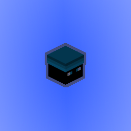

# YedelMod

Use /yedel (/yedelmod) for settings and more info.

Use /yedel update or the check for update button in the settings menu to check for updates on Modrinth or GitHub.

Use /yedel yedelmessage for messages from me regarding the mod. These are usually tips or bug notices.

## Developing

This mod uses the OneConfig tweaker to load OneConfig, both in the development environment and in production (manifest).
However, using the tweaker in development environment causes other OneConfig mods (in run/mods) to not load OneConfig.
If you are using other OneConfig mods, remove the tweaker from the run config.

## Features

Features

- Auto Welcome Guild Members
- Custom Hit Particles
- Dropper AutoGG
- Regex Chat Filter
- Random Placeholder
- SkyWars Strength Indicators
- Limbo Creative Mode
- Favorite Server Button
- Custom Text HUD

Commands

All hosted under /yedel (yedelmod):

- cleartext
- constants
- formatting
- limbo (li)
- limbocreative (limbogmc, lgmc)
- ping [method]
- playtime (pt)
- setnick [nick]
- settext [text]
- settitle [title]
- simulatechat (simc) [text]
- update [platform]
- yedelmessage (message)

Keybinds

- Submit insufficient evidence verdict
- Submit evidence without doubt verdict

BedWars

- BedWars Defusal Helper

- Light Green Token Messages
- Hide Token Messages
- Hide Bedwars XP Messages
- Hide Item Purchase Messages
- Hide Punch Deposit Messages
- Hide Slumber Ticket Messages
- Hide Silver Coin Count
- Hide Comfy Pillow Messages
- Hide Dreamer's Soul Fragment Messages
-
- Bedwars XP Display HUD
- Magic Milk Time HUD

TNT Tag

- Bounty Hunting

