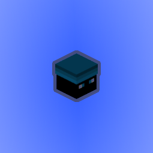

# YedelMod

Expansive features for Hypixel and Minecraft QOL

## Features

Features

- Custom Hit Particles
- Regex Chat Filter
- Random Placeholder
- Favorite Server Button
- Auto Welcome Guild Members
- Dropper AutoGG
- SkyWars Strength Indicators
- Limbo Creative Mode
- Easy Atlas Verdicts
- Custom Text HUD

Commands

All hosted under /yedel (yedelmod):

- cleartext
- constants
- formatting
- limbo (li)
- limbocreative (limbogmc, lgmc)
- ping [method]
- playtime (pt)
- setnick [nick]
- settext [text]
- settitle [title]
- simulatechat (simc) [text]
- update [platform]
- yedelmessage (message)

TNT Tag

- Bounty Hunting

